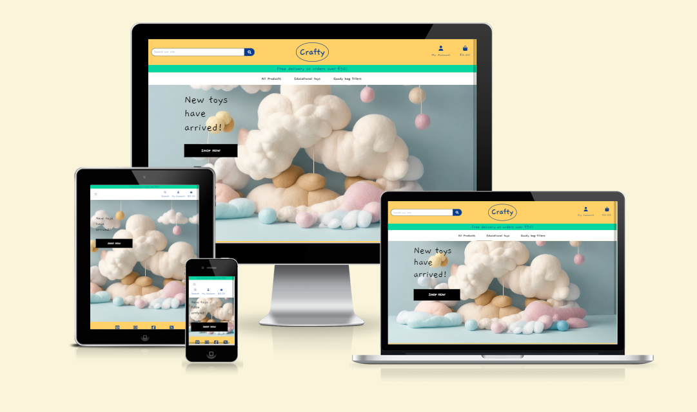

# [Crafty](https://pp5-crafty-015973d8fb4f.herokuapp.com/)
##### by Juan A. Boccia
Elevate Playtime with Crafty: High-Quality Custom Toys for Children



> Crafty is an e-commerce site that offers high-quality custom toys for children, designed to raise playtime to new levels. These toys are individually handcrafted with precision and care to ensure they meet the highest standards of quality. Explore Crafty's collection to enhance your child's play experience with premium personalized toys.

### [Live site](https://pp5-crafty-015973d8fb4f.herokuapp.com/) | [Repository](https://github.com/jbocciadev/PP5-crafty)

## UX and Design

Given the target audience and materials used in crafting the products, a decision was made that Crafty needed a clean, uncluttered appearence, with a soft palette of colours and a friendly, relaxed tone.

### Wireframes 
   Click [here](/readme-files/Crafty-wireframes.pdf) to view the Wireframes design for the site.

  ---

### [Colour Palette](/readme-files/crafty-palette.PNG)
  

  ---
### [Background imagery](/media/crafty_background.jpg)
  

  The background image was developed using [Leonardo.ai](https://leonardo.ai/). The prompt generation tool was very helpful in narrowing down the final prompt to be used.

  ---

### Inspiration

Needless to say that this project draws heavily on the Boutique Ado walkthrough projectfrom Code Institute. Further sources for inspiration are:
  - [Etsy](https://www.etsy.com/)
  - [Smyths toys](https://www.smythstoys.com/)
  - [Odin Parker](https://odinparker.com/collections/felt-toys)
  - [Pinterest](https://www.pinterest.com/rockys2mom/childrens-felt-toys/)


## Business Model

### Overview

Crafty is a B2C e-commerce platform that provides its customers high-quality goods. The products can be grouped in 3 general categories: Toys, activity packs and party bag fillers.

Born from lengthy conversations among a group of parents concerned about their childrens' development and with an aptitude for arts and crafts, Crafty caters for children between 0 and 10 years of age. For the smaller ones, it presents a series of sensory-focused toys, where the aim is to help promote a healthy development of their minds and senses. For toddlers, it boasts a wider variety of items including puzzles and handcraft activities aimed at helping them practise and learn about the world around them in a fun, friendly way. Finally, it proposes screen-free alternatives for the older group. All products can be made-to-order and customised to suit requirements of the customers.

---
### Target Audience

The niche group Crafty aims at is comprised mostly of invested parents of young children, who take an active role in their development and are looking for alternatives to over-stimulating products, usually characterised by being composed of hard plastic, bright colours, flashing lights and loud sounds.

---
### Site aspirations

Crafty aims at presenting an easy to navigate platform, where products are clearly laid out and are easy to browse. The checkout process is swift and easy. It also allows customers to have a profile they can use to manage their relationship with the company. Customers can also contribute with reviews of the products they have purchased in the past and they can keep informed of news and developments by means of a Newsletter.

---
### Marketing

Crafty comes as a natural next-step to the development of an already established activity that has grown by word of mouth due to the creative nature and high quality of the products sold.

As is natural of other business, Crafty aims to grow, but at a sustainable rate. The fact that the products are handmade makes it unviable to maintain an agressive marketing campaign, as the company could potentially fail to meet demand and this would negatively impact the customer experience. The company already boasts a healthy customer base and is continuing to grow.

Online presence is a front that Crafty are eager to explore. Initially, this would continue to be done via word of mouth among friends and family, progressing to a wider audience. Instructional videos and reviews are in the plans as well as collaborations with schools and in specialized trade fairs.

  ### [Facebook business page](https://www.facebook.com/profile.php?id=61556590172134)
  
      
  A Facebook page was created with the aim to promote the main Crafty website. Here, the main background of the site is used for the background banner, and as a profile image, a picture taken at one of our family kitchen/workshops.


## SEO

From early in the planning stage of the project, research was done on SEO-specific areas. It was immediately evident that neither demand nor competition were elevated, but this did not present an issue.
### Keywords
  See below for keyword research activity notes:

  

---
### Links
  As a way to provide additional valuable resources to visitors and also raise chances of higher SEO ranking, links to sites by reputable and authoritative entities are provided:

  

---

### Sitemap and Robots

  A sitemap.xml file was created and stored in the root directory of the site for search engines to be able to find more effectively.
  Additionally, a robots.txt file was created and placed in the same location so as to enable search engines to crawl and index the site. The accounts, bag and admin apps were explicitly mentioned as they are of no value to such portals.

---

### Registration with Google search console
  The site has been submitted to the google search console to benefit from the metrics that this site provides.
  

---

## Development

### Version control

- The chosen IDE for the development of the application was [VS Code](https://code.visualstudio.com/). Occasionally, [Gitpod](https://gitpod.io/) was used where issues were found and remote assistance was required, as well as system limitations.

- [GitHub](https://github.com) is the platform where the repository for Crafty is hosted: [Jbocciadev Crafty](https://github.com/jbocciadev/PP5-crafty).

Throughout development, the below commands were utilised to capture and store changes:
```
git add .
git commit -m "Message in quotation marks."
git push
```
additionally
```
git pull
git stash
git commit --amend
```
---

## Agile Development

From the very begining, Agile development practices were adopted so as to maintain focus and keep track of the various requirements to be delivered.

As an agile development technique, __Github Projects__ was used, taking special focus on the Kanban project board view
  > You can access the project [here](https://github.com/users/jbocciadev/projects/8).

With the "Everything is an issue" approach, Epics and User Stories were raised as project issues. These were organised in Milestones that loosely aligned with the Epics, but also included other crucial points in the development roadmap.

Issues were classified following the MOSCOW model. The labels thus assigned were continually revisited and reassessed, and a small number of them needed to be placed in the backlog and left to be implemented in a future opportunity.

### Milestones:

1. Generic issues view


2. Basic site setup


3. Products app


4. Bag app


5. Checkout and Stripe integration


6. User Profile


7. Advanced Products


8. Products Reviews


9. Contact app


10. SEO and Legal


---

## Functionality

  ### User signup, login and logut
  Users can signup to create an account to Crafty. A email confirmation message is sent to the user on registration. Once the email is confirmed, the user can access their personal profile.

  ### Profile/Account
  
  The Profile section is divided in 4 sub-sections:
  - Personal details: contains details about the user account.
  - Delivery information: stores the default delivery details for the user.
  - Order History: contains a table with a breakdown of the orders submitted by the user.
  - Contact: here, the user can submit contact queries via a form for any issues or concerns that may arise. A copy of the contact form is sent to the user and another is sent to the support team mailbox.

  ### Products
  From the main navigation bar, the user can access the products, either as a whole, or as smaller subsets, labelled accordingly by their respective groupings. By clicking/tapping on an individual product, the user is redirected to that product's detail page, where they dcan see further information, including reviews, and add the item to their bag. When a new item is added, removed, or its quantity is amended, a feedback toast message is displayed for the user.

  ### Bag
  The bag page displays an itemised breakdown of the products the user has selected for purchasing, with quantities that can be updated, and option to remove the individual item altogether. A summary of the subtotals is displayed at the bottom-right corner.Below this summary, there is a checkout button that redirects the user to the final checkout page.

  ### Checkout
  This page contains a form for the user to submit the required details for the purchase, along with a summary of the items that are about to be acquired. The payment is handled by Stripe, which ensures the card's validity and processes the charge. On successful checkout, the user is redirected to the checkout success page where a further order summary is presented to them. A confirmation email is sent to the user and sales team mailbox and a feedback message is presented.

  ### Newsletter signup
  Both registered users and non-registered users can register to receive our newsletter by clicking/tapping on the footer link and completing the form presented. A confirmation email is sent to the user with a unique link to unsubscribe if they so choose.

## Under the Proverbial Hood

  ### Models
  


  #### User
  Standard Django user model

  #### User Profile
  With a 1-1 relationship with the User model, this model stores complementary contact details for the user.

  #### Category, Age group and Topic
  These single-field models are designed to add flexibility for site management.

  #### Product
  A major model, this stores all relevant information about the different products. There are many-to-one relationships established with the Category, Age group and Topic models.

  #### Order
  Another major model, this contains all the relevant details for the successful completion of the purchase. Maintains many-to-one relationships with the User model and one-to-many with Order line item model.

  #### Review
  This 100% custom model allows for users to submit reviews and rating of products they have purchased. Many-to-one relationships with the User and Product models.

  #### Order Line Item
  This model is crucial to maintain an ordered, itemized connection between the Product model (many OLIs can have the same product) and the Order table (one Order can contain many OLIs).

  #### Contact
  Another 100% custom model, this stores all the details for customer's queries submitted via the website. There is a many-to-one relationship with the User model.

  #### Subscriber
  A third 100% custom model, this keeps track of subscribers to the Mailbos. There are no relationships established as users and non-users can subscribe.

  ---

  ### Tech Stack

  The following technologies were used to develop and run this application:

  - Django v3.2.23
  - Psycopg2 v2.9.9 (PostgreSQL)
  - Gunicorn v21.2
  - Bootstrap v4
  - Stripe v7.6
  - S3transfer v0.10 (Amazon AWS S3)
  - Elephant SQL
  - Git
  - VSCode
  - Python
  - HTML
  - CSS
  - JavaScript

---

## Testing

  ### Google Lighthouse
  
  The issues identified are minor and do depend mostly on external resources.

  ### HTML code validation
  

  ### CSS code validation
  

  ### Manual testing
  Please see the attached file for manual [testing matrix](/readme-files/pp5-crafty_Testing_Matrix.pdf).
  
---

## Deployment

The application has been deployed to heroku. The steps taken were:

In heroku:

- Open the "new" menu and click on "Create new app".
- Fill form fields with app name and region (Europe). Click on "Create app".
- In the "Settings" section, click on "Add buildpack" and add Python.
- In the "Settings" section, add the following config variables: ALLOWED_HOSTS, CLOUDINARY_URL, DATABASE_URL, PORT, SECRET_KEY.
- In "Deployment method", select the GitHub option and provide the repository details. Click on "Connect".
- Click on "Enable Automatic Deploys" and finally, click on "Deploy Branch".

To attach The Database:

-  Login or sign up to ElephantSQL.
-  Press create a new instance.
-  Choose a name and plan. Then click on select region.
-  Select the closest Data Center to you
-  Click on "Create Instance".
-  Go back to the start page and click on your new database.
-  Copy the URL for the database.

Go back to Heroku and click on the settings tab of your application.

Click on "Reveal config vars".

Add a new config var named DATABASE_URL and paste in the URL from ElephantSQL as the value.

Go back to Gitpod or the IDE you are using and install two more requirements for the database:

`pip3 install dj_databse_url` `pip3 install psycopg2-binary`

Update your requirements.txt file by typing in `pip3 freeze --local > requirements.txt`

Add the DATABASE_URL to your env.py file or environment variables in gitpod.

Go to settings.py and `import dj_database_url`

Comment out the default DATABASES setting.

Add this under the commented out section:
``` DATABASES = {
    'default': dj_database_url.parse(os.environ.get('DATABASE_URL')) }

```

Run migrations for the new database.

In the root directory of your project, create a file called "Procfile" and add web: gunicorn project_name.wsgi so Heroku will know what kind of application it is.

In settings.py add ['app_name.heroku.com', 'localhost'] to ALLOWED_HOSTS.

Commit and push these changes to GitHub.

In the Heroku settings tab of your project update the config vars to the following:

| Key | Value  |
| -- | -- |
|AWS_ACCESS_KEY_ID|From AWS in CSV Download|
|AWS_SECRET_ACCESS_KEY|From AWS in CSV Download|
|DATABASE_URL|From ElephantSQL dashboard|
|EMAIL_HOST_PASSWORD|App Password from Email Client|
|EMAIL_HOST_USER|Email address|
|SECRET_KEY|Randomly Generated Django Key|
|STRIPE_PUBLIC_KEY|Publishable key from Stripe Dashboard|
|STRIPE_SECRET_KEY|Secret key from Stripe Dashboard|
|STRIPE_WH_SECRET|Signing secret from Stripe Webhooks Endpoint|
|USE_AWS|True|

If you deploy at the beginning of the project then add the key value of: DISABLE_COLLCETSTATIC and set it to 1. When you have staticfiles to push then remove this variable.

Once the project is completed and you are no longer working on it set DEBUG = False in settings.py.

Log in to Heroku and select the deploy tab on your Heroku App and connect your GitHub account.

Search for your repository and connect it.

Once you have selected the correct repository, scroll down and click "Deploy Branch".

Watch the log as it deploys your project and ensure there are no errors.

If everything is correct it should deploy successfully.

Click on open app at the top of the page to view your deployed app.

---

### Known issues and further development opportunities
  - Some styling issues remain. Due to time constraints and minor impact, these were left and can be dealt with at a later time.
  - On some instances, responsiveness may not be as smooth as desired, but it is not a serious issue.
  - Multiple opportunities lie ahead for Crafty to move forward. An FAQs section was initially planned, but it needed to be discarded for this iteration. Also, a blog with articles, videos, step-by-step guides and comments can be developed. Finally, the Contact section can be developed to present messages from the support team as response to the customers' queries. A custom platform could also be developed to facilitate the work of the staff, while preventing them from accessing the /admin/ portal.


## Thanks

First and most importantly, to my family. My wife and children who have carried me along this journey are the best one could ask for and I owe them everything. Also my parents who have always worked hard to give me the best of everything they could possible provide and set an exceptional example of high standards, kindness, generosity and character.

To my friends Juan and Paco, who always encouraged me to pursue a career in coding, muchas gracias!

To my cohort facilitator Alan, a huge thanks for your patience and support. My Mentor Spencer who is so knowledgeable and yet so down-to-earth has always been good at nudging me in the right direction, thanks!

To the broad team at Code Institute: facilitators, student support, tutors, coordinators and those guys whose role is not quite clear and yet keep popping up on slack to say the right word at the right time, thank you and congratulations. You put together a great show!

To my fellow cohort colleagues and hackathon teammates, thank you for putting up with me during calls. I hope I run into you in the future.

To the bigger names at Code Institute, a massive thank you for having made this. The course, along with the support network and all the resources are unbelievable and so invaluable!

As usual, a big thank you to Prof. Malan for opening my eyes and transmitting such love for this art that is software development.

### Credits and Reference

User authentication:
https://docs.djangoproject.com/en/4.2/topics/auth/default/ Login required mixin

Django Forms
https://developer.mozilla.org/en-US/docs/Learn/Server-side/Django/Forms

Querying with list of values:
https://stackoverflow.com/questions/9304908/how-can-i-filter-a-django-query-with-a-list-of-values

Form querysets:
https://docs.djangoproject.com/en/4.2/ref/models/querysets/ (see Q https://docs.djangoproject.com/en/4.2/ref/models/querysets/#django.db.models.Q and select_related)

Querying:
 - Field lookups: https://docs.djangoproject.com/en/4.2/ref/models/querysets/#field-lookups
 - One-to-one relationships: https://docs.djangoproject.com/en/4.2/topics/db/examples/one_to_one/

Landing page image generated using Leonardo AI:
https://leonardo.ai/

Database ERD:
https://dbdiagram.io/

Github Issues, Epics, etc:
https://ardalis.com/working-effectively-github-issues/  

https://www.birme.net/  Images optimization for web

Building dynamic queries based on multiple criteria
https://stackoverflow.com/questions/54454051/dynamic-query-django-build and https://forum.djangoproject.com/t/fielderror-related-field-got-invalid-lookup-iexact/16119/2 

Guide on the admin site customization
https://earthly.dev/blog/customize-django-admin-site/ 

Reference on UUID field
 https://docs.djangoproject.com/en/dev/ref/models/fields/#uuidfield

Privacy policy generator
https://www.termsfeed.com/privacy-policy-generator/

Text generator used for About-us section
https://www.semrush.com/goodcontent/ai-text-generator/

Favicon generator
https://favicon.io/favicon-generator/

Tip on redirecting user back to url where they submitted the form
https://stackoverflow.com/questions/35796195/how-to-redirect-to-previous-page-in-django-after-post-request

Overriding save methon on Django models
https://www.geeksforgeeks.org/overriding-the-save-method-django-models/

Overriding __init__ methon on Django models
https://stackoverflow.com/questions/60481894/overwrite-django-model-init-method

Removing key from request querydict in Django
https://stackoverflow.com/questions/29492894/how-to-remove-key-from-request-querydict-in-django

Counting reviews for Product
https://stackoverflow.com/questions/74116689/how-to-count-reviews-for-a-product-in-django

Updating records with Modelform
https://stackoverflow.com/questions/53801805/can-we-use-modelform-to-update-an-existing-instance-of-a-model

Counting entries in Django model table
https://stackoverflow.com/questions/15635790/how-to-count-the-number-of-rows-in-a-database-table-in-django#:~:text=You%20can%20either%20use%20Python's,the%20provided%20count()%20method.&text=You%20should%20also%20go%20through%20the%20QuerySet%20API%20Documentation%20for%20more%20information.
